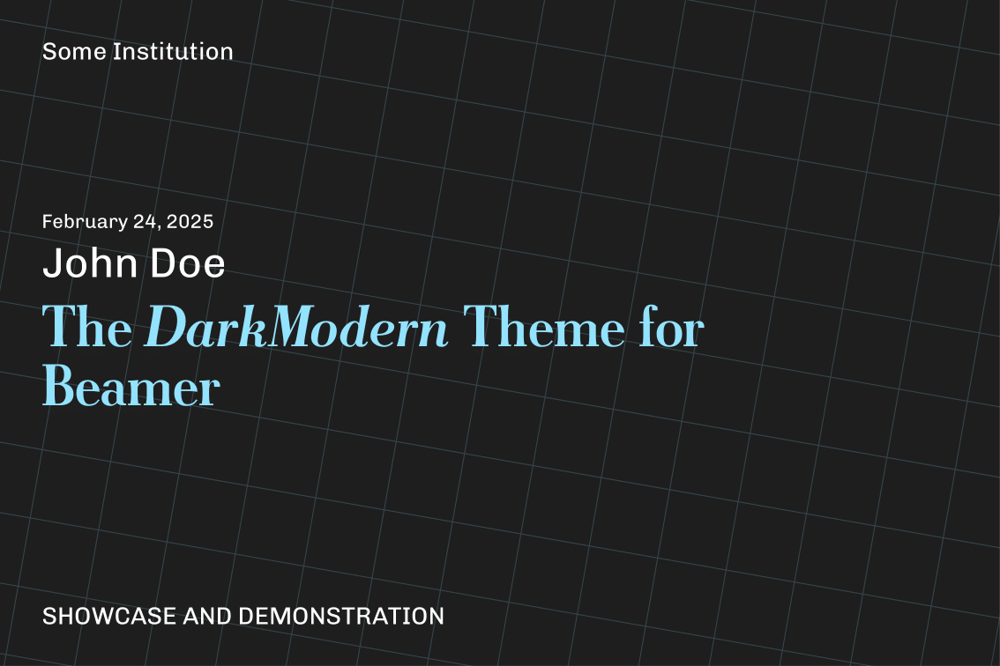

# DarkModern: A Dark Theme for LaTeX Beamer  

**DarkModern** is a sleek, dark theme for [LaTeX Beamer](https://ctan.org/pkg/beamer), loosely inspired by the default [Dark Modern](https://github.com/microsoft/vscode/blob/bb766b362c7a12012d97b82bd1538cecd109f5c7/extensions/theme-defaults/themes/dark_modern.json) theme in [Visual Studio Code](https://github.com/microsoft/vscode).  

## Installation  

To use **DarkModern**, copy all theme files into the root directory of your LaTeX project and include the following in your preamble:  
```tex
\usetheme{DarkModern}
```
For a comprehensive example, refer to `demonstrain.tex`.

## Preview
<p align="center">
    
    <br>
    <i>Preview of <code>demonstration.tex</code></i>
</p>
```
